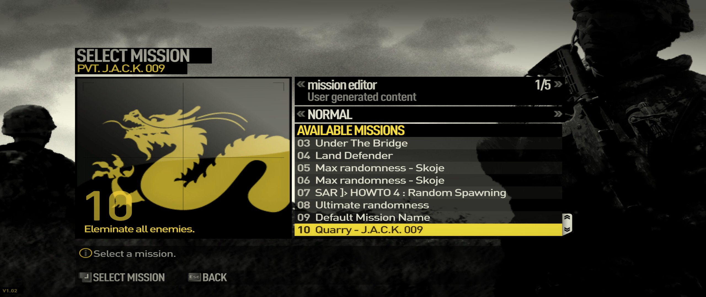

# Operation-Flashpoint-Dragon-Rising
Custom missions that were created with the OF:DR Mission editor.

- - - -

## Mission editor: edit missions ##

Look for the Operation Flashpoint Dragon Rising mission editor and select a .mssn file from the source folder.

## Installation: ##
Place the custom missions folder the custom missions game directory ex.:
G:\GAMES\OF Dragon Rising\data_win\missions\Mission Editor\

## Play: ##
In the main menu go to single Mission, look for mission editor missions, select the desired mission.

- - - -

## Missions: ##

### Allies&Enemies: ###

Infinite waves of attacking. 
Creator: cRankface

### Bridge: ###

Attack and defend a bridge. 
Creator: cRankface

### (Land) Defender: ###

Defend yourself against waves of enemies. 
Creator: cRankface

### Maxrandomness1: ###

Random settings in a small town. Random enemies, time of day, spawn, artillery, kill limit. Easy to move other spawn locations in map editor. 
Creator: J.A.C.K. 009

### Maxrandomness2: ###

Random settings in a small town. Random enemies, time of day, spawn, artillery, kill limit. Easy to move other spawn locations in map editor. 
Creator: J.A.C.K. 009

### Quarry: ###

Eliminate all enemies. 
Creator: J.A.C.K. 009

### Ultimate randomness: ###

Another version of Maxrandomness. 
Creator: J.A.C.K. 009

